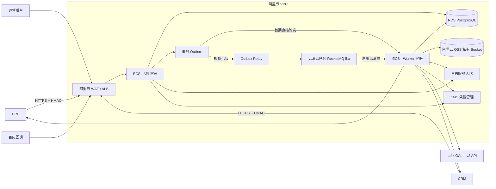
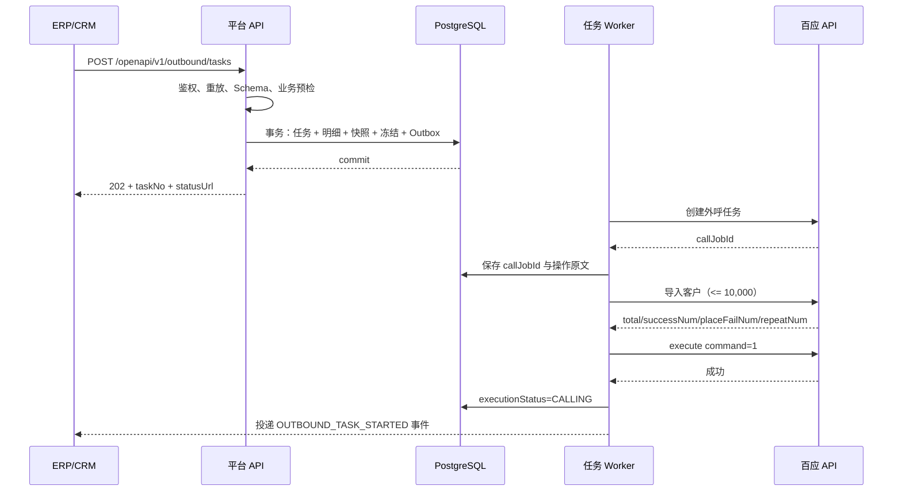
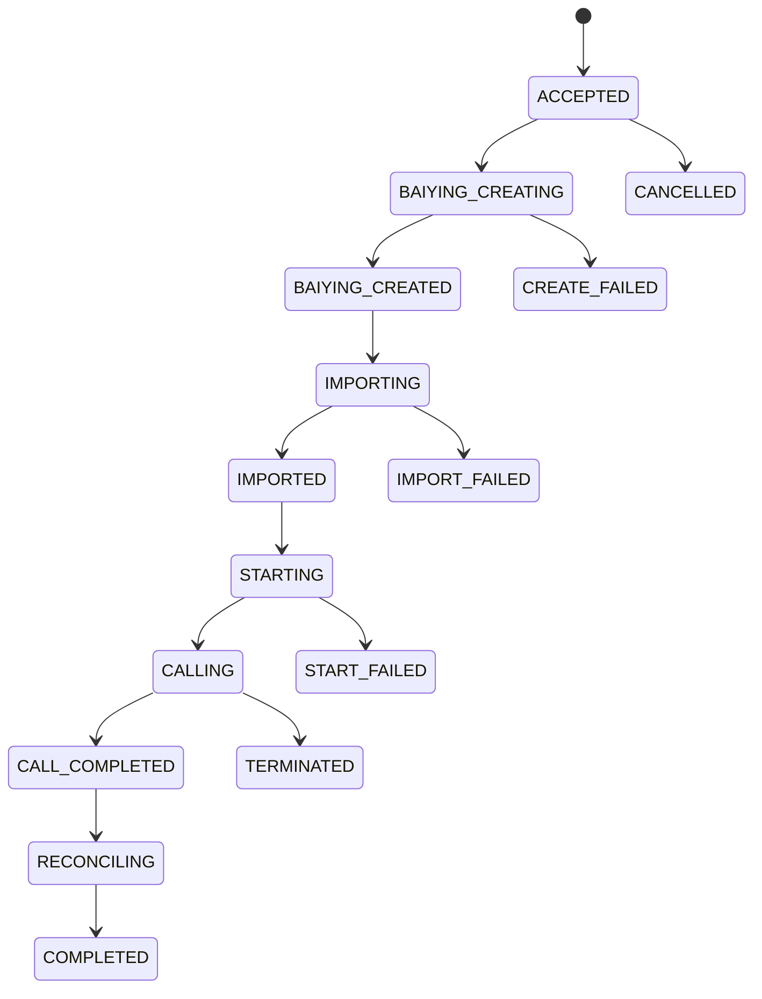

# 新增外呼任务端到端可执行方案

> 文档状态：执行中；阶段 0、1、2A、3A 已完成
> 版本：v1.0  
> 编制日期：2026-09-06  
> 适用系统：6+1 ERP、CRM、智能外呼调度平台、百应开放平台  
> 目标部署环境：阿里云 ECS + RDS PostgreSQL + OSS  
> 本文是当前实施、任务拆分与联调验收基线。

## 1. 结论摘要

本方案建议把智能外呼平台建设为 ERP/CRM 与百应之间的可靠调度层，而不是把三个百应接口直接串在一个 HTTP 请求里。

推荐的最终链路是：

```text
ERP / CRM
  → 鉴权、幂等、业务校验
  → 创建平台任务、冻结影楼余额、固化配置快照
  → 返回 202 Accepted + 平台任务编号
  → 异步创建百应任务
  → 异步导入号码
  → 异步启动百应任务
  → 接收百应任务状态与单次呼叫结果回调
  → 逐通话结算、归档录音
  → 向对应 ERP / CRM 投递结果和录音清单
  → 对账、补偿、人工重放
```

首版采用以下关键规则：

1. **一个 ERP/CRM 请求对应一个平台任务和一个百应 `callJobId`**。
2. **一个任务只能使用一个话术和一条线路**。请求中的全部数据分类必须解析到同一话术、同一线路，否则整体拒绝，不自动拆分。
3. **任务来源由调用凭证决定**。请求体中的 `sourceSystem` 只用于交叉校验，不能由调用方任意冒充 ERP 或 CRM。
4. **平台只对通过校验的实际客户明细计数**，不信任调用方单独传入的“号码数量”。首版每个请求最多 10,000 条。
5. **创建接口默认异步受理**。本地校验失败立即返回业务错误；受理成功返回 `202 + taskNo`；百应创建、导入、启动的结果通过查询接口及平台回调通知 ERP/CRM。
6. **百应导入采用严格模式**：只有 `successNum == total`、`placeFailNum == 0`、`repeatNum == 0` 才启动任务。部分导入视为失败，终止百应任务并释放冻结金额，避免只拨打一部分客户造成业务和账务争议。
7. **执行、结果回传、录音归档、录音回传、计费是五条独立状态线**。页面可以继续聚合展示，但数据库不得用一个状态字段表达全部过程。
8. **回调先落库再应答**。收到百应回调后先原文持久化，再返回 `{"code":200}`；下载录音、计费、回传 ERP/CRM 均异步处理。
9. **录音默认归档完整录音 `luyinOssUrl`**，保存到平台控制的阿里云 OSS 私有 Bucket，不把百应临时地址直接交给 ERP/CRM。
10. **金额全部使用十进制定点数**，逐通话按 `ceil(duration / 60)` 计算计费分钟，并通过唯一业务键保证重复回调不会重复扣费。

## 2. 依据、边界与冲突处理

### 2.1 本方案采用的依据

按以下职责使用三类信息：

| 来源                         | 负责定义                                     | 使用方式                                 |
| ---------------------------- | -------------------------------------------- | ---------------------------------------- |
| 现行平台页面                 | 现有菜单、配置项、列表字段和运营交互         | 尽量保留页面结构，补齐真实后端与必要状态 |
| 新文档《新增外呼任务描述词》 | 业务校验、任务字段、费用冻结、回调和录音目标 | 作为本次业务需求主依据                   |
| 百应现行官网 OAuth v2 文档   | 百应接口地址、参数、状态、认证与回调规则     | 作为供应商技术契约唯一依据               |

### 2.2 明确排除

- 不引用、不继承父级 PRD 的账户模型、父子任务、拆单或其他未在现行页面和新文档中出现的规则。
- 不接入旧版 HMAC 或 v1.25 百应接口。
- 首版不做定时外呼、自动选话术、自动选线路、跨话术拆任务。
- 首版不允许一个任务跨影楼、跨 ERP/CRM 来源。

### 2.3 冲突优先级

不同来源发生冲突时按职责处理，而不是简单覆盖：

1. 百应请求字段、地址、状态约束、回调应答等供应商契约，以百应现行官网为准。
2. 影楼识别、费用冻结、业务拦截、回传目标等业务规则，以新文档为准。
3. 页面字段、配置方式和运营操作，以现行页面为准；如果页面只是静态样例或无法保障数据正确性，则补齐后端实现。
4. 本方案中的可靠性、安全性和幂等规则，在不改变业务结果的前提下作为强制工程约束。

### 2.4 对原流程的必要修订

| 原描述                                                   | 本方案定案                                                           | 原因                                                                         |
| -------------------------------------------------------- | -------------------------------------------------------------------- | ---------------------------------------------------------------------------- |
| 在一个新增任务请求里等待百应创建、导入、启动完成后再响应 | 默认返回 `202 Accepted`，后续通过查询和事件回调获得结果              | 三次外部调用可能超时；调用方重试会造成重复任务，百应创建接口又没有业务幂等键 |
| 启动、暂停、终止写在新增任务同一步                       | 新增任务只调用 `command=1` 启动；暂停和终止是独立命令接口            | 三个命令互斥，不能在一次新增流程里同时调用                                   |
| 任务“执行完成”依赖 ERP/CRM 结果和录音回传全部成功        | 百应执行完成即显示“执行完成”；结果和录音回传在独立列展示             | 接收方宕机不应把已完成通话显示成仍在呼叫                                     |
| 录音获取数量只用一个数字表示                             | 分成发现、归档、已回传三个计数；主列表“录音获取数量”保持表示发现数量 | 能区分百应给了地址、平台已下载、ERP/CRM 已收到三种情况                       |
| 百应导入接口返回成功即启动                               | 首版要求全量导入成功才启动                                           | 官方返回包含成功、失败、重复数量，HTTP/业务成功并不等于每条数据成功          |

## 3. 目标与非目标

### 3.1 P0 目标

- ERP/CRM 能通过标准接口创建立即执行的外呼任务。
- 平台能通过 `MC code` 唯一定位启用中的影楼。
- 平台能校验回调地址、价格、余额、分类、话术、线路和变量映射。
- 平台能原子创建任务、冻结余额并记录不可变配置快照。
- 平台能可靠调用百应创建、导入、启动接口。
- 平台能接收百应任务状态和单次呼叫结果回调，并保留原始报文。
- 平台能按单次通话时长结算客户费用、平台成本和收益。
- 平台能及时下载录音并向对应 ERP/CRM 回传结果和录音清单。
- 所有外部调用具备幂等、重试、死信、人工重放与审计能力。
- 现行页面中的任务、影楼、话术、线路、映射和话费配置改为真实后端数据。

### 3.2 P0 非目标

- 不支持超过 10,000 条的单次创建请求。
- 不支持一次请求自动拆成多个平台任务或多个百应任务。
- 不支持跨多个话术或多条线路的混合任务。
- 不支持定时任务和周期任务。
- 不支持由平台自动充值或自动恢复欠费任务。
- 不承诺跨系统“恰好一次”投递；采用“至少一次投递 + 幂等消费”。
- 不把 ERP/CRM 的全部业务字段建设成平台数据字典，只处理百应话术需要的字段。

## 4. 当前系统评估

### 4.1 当前已经具备的基础

现有工程可直接复用：

- React + TypeScript 运营页面。
- Hono + TypeScript 后端。
- PostgreSQL + Drizzle ORM。
- 百应 OAuth v2 Token 获取与资源客户端。
- 百应公司、话术、线路、余额、话术变量等读取能力。
- 数据分类、话术绑定、线路与影楼绑定、变量映射版本与任务映射快照的基础表。
- `queue_outbox`、`idempotency_record`、`audit_log` 基础设施。
- 百应单次呼叫回调 Schema 校验和计费分钟计算函数。

### 4.2 当前页面现状

现行页面已经表达了本需求所需的大部分运营概念：

- 影楼管理包含余额、费率、`MC code`、ERP/CRM 结果地址和录音地址。
- 话费设置支持统一价格和单影楼价格，包含话费单价、短信单价、冻结分钟数和生效时间。
- 任务列表已经展示影楼、来源、分类、话术、映射、线路、百应任务 ID、结果回传、录音回传、时长、计费与利润字段。
- 话术可绑定来源、多个数据分类、一个影楼和一条线路；线路可绑定多个影楼。

但这些任务、影楼和价格数据当前仍以静态数据或浏览器 `localStorage` 为主，不能作为正式业务账本。

### 4.3 当前后端缺口

| 能力                     | 当前状态                    | P0 处理                              |
| ------------------------ | --------------------------- | ------------------------------------ |
| 真实影楼与回调地址持久化 | 缺失                        | 新增影楼、集成端点及版本表           |
| 价格版本与账户账本       | 缺失                        | 新增价格版本、账户、流水、资金冻结   |
| 平台外呼任务与客户明细   | 缺失                        | 新增任务、客户明细、操作记录         |
| 百应创建/导入/执行       | 缺失                        | 扩展独立 `call-job` 客户端           |
| 回调原文可靠保存         | 当前仅解析、日志和可选 hook | 新增 Inbox 表；持久化成功后才 ACK    |
| 回调业务处理             | `server.ts` 未注入处理器    | 新增回调消费者和状态归一化           |
| 录音下载与对象存储       | 缺失                        | 新增录音 Worker、对象存储和元数据表  |
| ERP/CRM 回传             | 缺失                        | 新增事件、投递尝试、重试和死信       |
| 任务查询与控制           | 缺失                        | 新增查询、明细、暂停、恢复、终止接口 |

## 5. 总体架构



### 5.1 部署单元

首版保持一个后端代码库，通过不同入口运行多个职责，不需要拆成多个微服务：

```text
ALB / WAF                   HTTPS 入口、证书、限流和百应回调 IP 控制
ECS                         运行 API 与各类 Worker 容器
api-service                 外部 API、运营后台 API
task-orchestration-worker   百应创建、导入、启动与控制
callback-worker             百应回调归一化、状态与计费
recording-worker            录音下载、校验和对象存储
delivery-worker             ERP/CRM 结果与录音回传
reconciliation-worker       百应任务/通话补偿查询
monthly-settlement-worker   海南人像平台成本月结
RDS PostgreSQL              系统记录库、账本、Outbox 和 Inbox
OSS                         私有录音对象与大报文
RocketMQ 5.x                规模化后的可选消息通道
KMS + RAM                   密钥、凭据和最小权限访问
SLS                         集中日志、查询和告警
```

首期直接使用 RDS PostgreSQL Outbox + `FOR UPDATE SKIP LOCKED` Worker，不把 RocketMQ 作为上线前置条件。消息量或 Worker 数量达到扩容阈值后，再由 Outbox Relay 将事件发布到阿里云云消息队列 RocketMQ 5.x。即使接入 RocketMQ，事务 Outbox 仍需保留，用于保证“业务数据提交”和“待发布事件写入”位于同一数据库事务中。

### 5.2 阿里云部署路径

#### 联调和小流量阶段

```text
1 台 ECS
  ├─ Nginx / Caddy
  ├─ api-service 容器
  ├─ task/callback/recording/delivery Worker 容器
  └─ SLS Logtail

RDS PostgreSQL 基础或高可用实例
OSS 私有 Bucket
KMS 凭据管理
PostgreSQL Outbox 队列
```

- 应用使用 Docker Compose 管理，容器设置自动重启和健康检查。
- 联调环境可以使用低规格 RDS；正式环境不能把账务数据库长期自建在单台 ECS 本地磁盘上。
- API 和 Worker 使用同一镜像、不同启动命令，减少发布物数量。
- OSS、RDS 与 ECS 选择同地域，优先使用内网地址。

#### 正式生产阶段

```text
公网 HTTPS
  → WAF（可选但推荐）
  → ALB
  → 2 台及以上跨可用区 ECS
      ├─ API 容器
      └─ Worker 容器（初期可同机，扩容后独立节点组）

  → RDS PostgreSQL 高可用系列
  → OSS 私有 Bucket + SSE-KMS + 生命周期规则
  → KMS 凭据管理 + ECS RAM 角色
  → SLS 日志与告警
  → RocketMQ 5.x（达到扩容阈值后启用）
```

生产数据库推荐 RDS PostgreSQL 高可用系列并跨可用区部署；阿里云该系列采用一主一备并支持故障切换。应用不得依赖固定数据库 IP，应使用 RDS 连接地址和连接池。

### 5.3 RocketMQ 启用阈值

满足任一条件时启动 RocketMQ 5.x 接入评估：

- Outbox 待处理消息持续超过 100,000 条。
- 最老待处理事件在正常容量下持续超过 5 分钟。
- Worker 需要跨多台 ECS 独立伸缩，数据库轮询造成明显锁竞争或 I/O 压力。
- 回调洪峰需要隔离任务编排、录音下载和 ERP/CRM 投递的资源配额。
- 需要消息轨迹、消费组隔离和更完善的消息可观测性。

接入时采用普通消息 Topic，并分别设置任务编排、回调处理、录音归档和外部投递 Consumer Group。TypeScript 服务使用阿里云云消息队列 RocketMQ 5.x 的 Node.js SDK 及 VPC 接入点；正式选型前固定 SDK 版本并完成重复投递、重平衡和优雅下线测试。

### 5.4 网络与端口

- ECS、RDS、OSS 和 RocketMQ 放在同地域；RDS、RocketMQ 只开放 VPC 内网访问。
- 公网只暴露 ALB/WAF 的 `443`，ECS 应用端口仅允许来自 ALB 安全组。
- RDS `5432` 仅允许应用 ECS 安全组访问。
- SSH `22` 只允许堡垒机或固定办公出口 IP，不向 `0.0.0.0/0` 长期开启。
- 百应回调 IP 白名单配置在 WAF/ALB 访问控制层；应用仍需做 Body、类型和幂等校验。
- ECS 出网需允许访问百应 OAuth/API、ERP/CRM 回调地址和百应录音地址。
- 所有阿里云服务优先使用内网 Endpoint，降低公网暴露和流量费用。

## 6. 核心业务规则

### 6.1 影楼与来源识别

1. `MC code` 在启用影楼中必须唯一，数据库建立唯一索引。
2. 调用凭证绑定唯一 `sourceSystem=ERP|CRM`。
3. 请求体必须包含 `mcCode`；可包含 `sourceSystem`，但其值必须与凭证一致。
4. 影楼不存在、已停用或 `MC code` 重复，任务不得受理。
5. 数据查询和操作权限必须限定在凭证允许的影楼范围内。

### 6.2 号码与数量

1. `customers` 数组长度为 1～10,000。
2. 手机号先去空格和分隔符，再规范为 E.164 或平台确认的大陆手机号格式。
3. 首版同一任务内不允许重复手机号；发现重复直接返回明细错误，不静默去重。
4. `phoneCount = 通过全部本地校验后的 customers 数量`。
5. 请求体不提供独立的可信 `phoneCount`；如为兼容保留该字段，只做一致性校验。
6. 百应导入明确传 `permitrepeatnum=false`。

### 6.3 分类、话术与线路

每条客户记录携带 `dataCategoryId`，平台据此汇总本任务全部分类并执行：

```pseudo
bindings = resolve(sourceSystem, studioId, distinct(dataCategoryId))

if any category does not exist or inactive:
  reject DATA_CATEGORY_NOT_FOUND

if any category has no active script binding:
  reject DATA_CATEGORY_SCRIPT_UNBOUND

if distinct(bindings.robotDefId).count != 1:
  reject DATA_CATEGORY_SCRIPT_CONFLICT

if distinct(bindings.userPhoneId).count != 1:
  reject DATA_CATEGORY_LINE_CONFLICT

if line is not bound to studio or no longer exists in latest resource sync:
  reject LINE_NOT_AVAILABLE
```

不自动拆任务的原因：一个请求若自动拆成多个百应任务，任务编号、冻结金额、ERP/CRM 回调和页面状态都会产生一对多语义，超出了当前页面和新文档的模型。

### 6.4 变量映射

1. 从已解析话术的最新成功变量快照获取所需变量。
2. 只使用已发布且状态可用的映射版本。
3. 根据 `sourceSystem` 选择 ERP 字段或 CRM 字段。
4. 对每条客户数据执行转换、默认值和空值规则。
5. 任一必需变量没有来源字段、没有默认值或转换失败，整个任务在受理前失败，并返回最多 100 条错误示例及总错误数。
6. 创建任务时固化映射版本和实际规则快照；后续修改映射不影响已创建任务。
7. 向百应 `properties` 中额外写入 `sx_platform_item_id`，用于在回调中精确关联平台客户明细。官方允许通过 `properties` 传入自定义参数。

### 6.5 回调地址

在任务受理前，必须同时校验当前影楼、当前来源对应的：

- 结果回传地址。
- 录音回传地址。
- 回调签名密钥引用。
- 端点状态为启用。
- URL 为 HTTPS 且通过平台的外部地址安全校验。

任务固化回调配置版本；任务创建后即使管理员修改影楼地址，旧任务仍投递到创建时的地址，除非管理员执行有审计记录的“迁移未完成投递目标”。

### 6.6 价格、冻结与结算

#### 客户价格

现行页面的“统一价格/单影楼价格”是编辑方式。发布时应为每家影楼生成一个不可变的解析后价格版本：

```text
customer_voice_rate
customer_sms_rate
frozen_minutes
effective_at
published_at
published_by
source_mode = UNIFORM | PER_STUDIO
```

任务冻结金额：

```text
reserved_amount = phone_count × frozen_minutes × customer_voice_rate
```

规则：

1. 金额使用 `numeric(18,6)` 计算，API 以字符串传输，禁止使用 JavaScript 浮点数作为账本金额。
2. 在同一数据库事务中锁定影楼账户、检查可用余额、创建冻结记录和平台任务。
3. 可用余额不足时返回 `INSUFFICIENT_BALANCE`，不得创建任务或调用百应。
4. 百应创建、导入或启动最终失败时释放全部未使用冻结金额。
5. 单次呼叫计费分钟为：`duration > 0 ? ceil(duration / 60) : 0`。
6. 客户实际话费为每条通话计费后汇总，不能先汇总秒数再统一向上取整。
7. 若实际话费小于冻结金额，任务对账完成后释放差额。
8. 若实际话费大于冻结金额，差额记为 `OVERAGE_DEBIT`；允许账户出现欠费状态并禁止新任务，但不能丢弃已发生通话账单。
9. 每条通话账单使用唯一键 `CALL_CHARGE:{companyId}:{callInstanceId}`，重复回调不得重复扣费。

#### 平台成本与收益

按现行页面“海南人像话费”阶梯执行：

1. 当月未结算前，依据当月累计计费分钟显示暂估平台单价、平台话费和收益。
2. 月末结算任务根据最终累计分钟确定供应阶梯，写入最终平台单价。
3. 月结后更新任务的最终平台成本与最终收益，但不改变客户已结算话费。
4. 页面必须明确标注“暂估”或“已结算”，避免把浮动供应价误认为固定快照价。

## 7. 新增任务端到端流程

### 7.1 推荐时序



### 7.2 同步受理步骤

按以下顺序执行，任一步失败立即停止：

1. 校验 HTTPS、客户端身份、HMAC、时间戳、Nonce、请求体大小和速率限制。
2. 校验 `Idempotency-Key`；同键同报文返回原响应，同键不同报文返回冲突。
3. 校验请求 Schema、客户数量、手机号、外部客户 ID 和重复数据。
4. 由凭证确定 ERP/CRM 来源，并与请求体交叉校验。
5. 通过 `mcCode` 查询唯一启用影楼。
6. 查询当前来源的结果和录音回传配置。
7. 查询当前生效的影楼价格版本。
8. 校验全部数据分类均存在且启用。
9. 校验全部分类解析到同一启用话术和同一线路。
10. 校验线路绑定当前影楼，且仍存在于最新百应资源同步结果中。
11. 校验话术变量快照未过期、全部映射已发布且所有客户值可转换。
12. 以服务端客户明细计算 `phoneCount` 和 `reservedAmount`。
13. 开启数据库事务，锁定影楼账户并检查可用余额。
14. 生成平台任务编号，保存任务、客户明细、价格/话术/线路/映射/回调快照。
15. 创建资金冻结、幂等响应和 `TASK_ACCEPTED` Outbox 事件。
16. 提交事务，返回 `202 Accepted`。

### 7.3 异步百应编排步骤

#### A. 创建百应任务

```text
POST /api/oauth/byai.openapi.calljob/1.0.0/create
```

核心参数：

```text
callJobName = {taskNo}-{shortHash}（taskNo 已含 PT- 前缀，例如 PT-20260906-00025-a1b2c3d4）
callJobType = 1（以百应正式环境确认值为准）
companyId   = 平台配置的百应公司 ID
robotDefId  = 任务话术快照
userPhoneIds = [任务线路快照]
accessToken = OAuth Token，放在 Body
```

成功条件统一判断为 `code=200`、`resultMsg=successful` 且存在 `data.callJobId`。

如果网络超时导致结果未知，**禁止直接重试创建**：

1. 使用确定性 `callJobName` 调用百应任务列表接口查询。
2. 查询到唯一任务则补写 `callJobId` 并继续。
3. 查询不到时延迟再次确认，仍不存在才允许重试创建。
4. 查询到多个同名任务则进入人工处理，禁止自动导入或启动。

#### B. 导入客户

```text
POST /api/oauth/byai.openapi.calljob.customer/1.0.0/import
```

请求包含：

```text
callJobId
companyId
customerInfoVOList
permitrepeatnum=false
accessToken
```

`customerInfoVOList` 每项：

```json
{
  "name": "王女士",
  "phone": "13800000000",
  "properties": {
    "婚期": "2026-10-18",
    "套餐意向": "轻奢婚纱照",
    "sx_platform_item_id": "01K4..."
  }
}
```

首版成功条件：

```text
code == 200
resultMsg == successful
data.total == task.phoneCount
data.successNum == task.phoneCount
data.placeFailNum == 0
data.repeatNum == 0
```

条件不满足时：

1. 保存完整失败明细。
2. 不调用启动。
3. 对未开始的百应任务执行 `command=3` 终止作为清理动作。
4. 平台任务标记 `IMPORT_FAILED`。
5. 释放冻结金额。
6. 向 ERP/CRM 投递 `OUTBOUND_TASK_START_FAILED` 事件。

#### C. 启动任务

```text
POST /api/oauth/byai.openapi.calljob/1.0.0/execute
command=1
```

调用成功后记录 `call_started_at`，状态进入 `CALLING`，并向 ERP/CRM 投递 `OUTBOUND_TASK_STARTED`。暂停和终止不在新增流程中调用，由独立命令接口触发。

## 8. 外部 API 设计

### 8.1 通用鉴权头

```http
X-Client-Id: erp-prod-01
X-Timestamp: 1788681600000
X-Nonce: 01K4J8...
X-Signature: base64(hmac_sha256(secret, canonical_request))
X-Request-Id: 01K4J9...
Idempotency-Key: erp-order-batch-20260906-001
Content-Type: application/json
```

签名原文：

```text
UPPERCASE_HTTP_METHOD + "\n" +
CANONICAL_TARGET + "\n" +
X_TIMESTAMP + "\n" +
X_NONCE + "\n" +
LOWERCASE_HEX_SHA256(raw_request_body_bytes)
```

`CANONICAL_TARGET` 为 URL path 加规范化 query，不含 scheme、host 和 fragment；query 的键和值按 RFC 3986 编码后按键、值升序排列。签名使用实际发送的原始 Body 字节，空 Body 使用 SHA-256 固定值。完整规则与 C#/PHP 示例见《ERP-CRM外呼接口联调手册》；实现不得只签 path 而忽略 query。

约束：

- 时间偏差不超过 5 分钟。
- Nonce 至少保留 10 分钟并拒绝重复。
- 幂等记录建议保留 7 天。
- 密钥只保存加密引用，不返回前端、不写日志。

### 8.2 创建外呼任务

```http
POST /openapi/v1/outbound/tasks
```

请求示例：

```json
{
  "schemaVersion": "1.0",
  "externalRequestId": "ERP-REQ-20260906-0001",
  "sourceSystem": "ERP",
  "mcCode": "MC-ZTY-001",
  "taskName": "国庆档期客户邀约",
  "customers": [
    {
      "externalCustomerId": "ERP-C-10001",
      "name": "王女士",
      "phone": "13800000000",
      "dataCategoryId": "SS1",
      "fields": {
        "wedding_date": "2026-10-18",
        "package_interest": "A",
        "consultant_name": "李梅"
      }
    }
  ]
}
```

受理成功：

```http
HTTP/1.1 202 Accepted
```

```json
{
  "code": "TASK_ACCEPTED",
  "message": "任务已受理，正在创建百应外呼任务",
  "requestId": "9bba018d-36b2-478d-af0a-af3f7d573937",
  "data": {
    "taskId": "c5f1d5e0-1c67-4d02-a7a3-58666ea55792",
    "taskNo": "PT-20260906-00025",
    "executionStatus": "ACCEPTED",
    "displayStatus": "执行中",
    "phoneCount": 1,
    "reservedAmount": "0.960000",
    "currency": "CNY",
    "statusUrl": "/openapi/v1/outbound/tasks/PT-20260906-00025"
  }
}
```

本地业务校验失败：

```json
{
  "code": "DATA_CATEGORY_SCRIPT_CONFLICT",
  "message": "本次数据分类匹配到多个话术，请拆分后重新提交",
  "requestId": "01K4J9...",
  "details": {
    "categories": ["SS1", "SS2"],
    "matchedRobotDefIds": ["5421020", "5390020"]
  }
}
```

### 8.3 查询任务

```http
GET /openapi/v1/outbound/tasks/{taskNo}
```

返回：

- 平台任务编号和百应任务 ID。
- 影楼、来源、分类、话术、线路和映射版本快照。
- 号码数量与百应导入结果。
- 执行、结果回传、录音归档、录音回传和计费状态。
- 冻结金额、实际客户话费、平台成本和收益。
- 创建、启动、百应完成、结算、回传完成时间。
- 失败阶段、错误码、用户可读提示和是否可重试。

### 8.4 查询通话明细

```http
GET /openapi/v1/outbound/tasks/{taskNo}/calls?cursor=...&limit=200
GET /openapi/v1/outbound/tasks/{taskNo}/calls/{callId}
```

- `limit` 默认 200，最大 500。
- 手机号默认脱敏，只允许所属来源和影楼查询。
- 返回结果、时长、计费分钟、费用、录音状态和投递状态。

### 8.5 任务控制

```http
POST /openapi/v1/outbound/tasks/{taskNo}/commands
```

```json
{
  "command": "PAUSE",
  "reason": "影楼临时暂停活动"
}
```

命令映射：

| 平台命令           | 百应 `command` | 说明                             |
| ------------------ | -------------: | -------------------------------- |
| `START` / `RESUME` |              1 | 仅百应允许的未开始或手动暂停状态 |
| `PAUSE`            |              2 | 仅百应允许暂停的状态             |
| `TERMINATE`        |              3 | 终止后不可自动恢复               |

命令也采用幂等键。平台先记录 `PENDING` 操作，再调用百应；最终状态以百应响应、任务状态回调或补偿查询确认，页面不做无依据的乐观终态。

### 8.6 余额与账单

```http
GET /openapi/v1/studios/{mcCode}/balance
GET /openapi/v1/studios/{mcCode}/ledger?cursor=...&limit=100
```

只向有权限的 ERP/CRM 凭证开放，金额均返回十进制字符串。

### 8.7 错误码

| HTTP | 错误码                            | 用户提示                              |
| ---: | --------------------------------- | ------------------------------------- |
|  400 | `INVALID_REQUEST`                 | 请求格式不正确，请检查必填字段        |
|  401 | `AUTHENTICATION_FAILED`           | 调用身份或签名校验失败                |
|  409 | `REPLAY_DETECTED`                 | 请求时间戳或随机数已使用              |
|  409 | `IDEMPOTENCY_CONFLICT`            | 同一幂等键对应了不同请求内容          |
|  404 | `STUDIO_NOT_FOUND`                | 未找到 MC code 对应的影楼             |
|  422 | `STUDIO_DISABLED`                 | 影楼已停用，不能创建外呼任务          |
|  422 | `CALLBACK_CONFIG_MISSING`         | 当前影楼的 ERP/CRM 回传地址未完整配置 |
|  422 | `PRICING_NOT_CONFIGURED`          | 当前影楼没有生效中的话费设置          |
|  409 | `INSUFFICIENT_BALANCE`            | 影楼余额不足，无法冻结本次任务费用    |
|  422 | `PHONE_INVALID`                   | 客户手机号格式不正确                  |
|  422 | `PHONE_DUPLICATED`                | 本次任务包含重复手机号                |
|  422 | `DATA_CATEGORY_NOT_FOUND`         | 数据分类不存在或已停用                |
|  422 | `DATA_CATEGORY_SCRIPT_UNBOUND`    | 数据分类尚未绑定话术                  |
|  422 | `DATA_CATEGORY_SCRIPT_CONFLICT`   | 多个分类匹配到不同话术，请拆分任务    |
|  422 | `DATA_CATEGORY_LINE_CONFLICT`     | 多个分类匹配到不同线路，请拆分任务    |
|  422 | `LINE_NOT_AVAILABLE`              | 话术线路未绑定当前影楼或资源已失效    |
|  422 | `MAPPING_NOT_READY`               | 话术变量映射未发布或同步已过期        |
|  422 | `MAPPING_VALUE_INVALID`           | 客户数据无法按已发布规则转换          |
|  429 | `RATE_LIMITED`                    | 请求过于频繁，请稍后重试              |
|  503 | `SERVICE_TEMPORARILY_UNAVAILABLE` | 平台暂不可受理新任务，请稍后重试      |

百应异步阶段失败不会修改创建接口已经返回的 HTTP 响应，而是写入任务状态并投递 `OUTBOUND_TASK_START_FAILED`。这是分布式系统中可实现、可追踪的语义。

## 9. 百应回调方案

### 9.1 回调入口

建议在百应配置一个统一入口：

```http
POST /api/v1/callbacks/baiying
Content-Type: application/json;charset=utf-8
```

根据 `data.callbackType` 分流：

| 回调类型               | 用途                                   |
| ---------------------- | -------------------------------------- |
| `CALL_INSTANCE_RESULT` | 单次呼叫结果、通话时长、录音、采集变量 |
| `JOB_INFO_RESULT`      | 百应任务状态变化                       |

### 9.2 安全与接收规则

1. 生产环境仅允许 HTTPS。
2. 在 WAF/负载均衡层允许百应官方公布的回调 IP：`120.55.46.3`、`42.192.127.32/27`。
3. 只信任受控反向代理写入的源 IP 头，不能直接信任公网 `X-Forwarded-For`。
4. 限制请求方法、Content-Type、Body 大小和请求速率。
5. 读取并保存原始请求文本、SHA-256、请求头摘要、接收时间和解析结果。
6. 对原始正文进行 JSON 解析和 Schema 校验；无法识别的字段保留，不因供应商新增字段丢失原文。
7. 原文成功持久化后立即返回 `{"code":200}`，不在回调 HTTP 链路里下载录音、计费或回传 ERP/CRM。
8. 重复回调返回成功，并由 Inbox 唯一键保证不会重复执行业务副作用。

百应官网当前说明：回调未获得 `success` 或 `{"code":200}` 时最多重试 15 次，共 16 次尝试。因此平台必须把重复和乱序回调视为正常情况。

### 9.3 回调幂等键

```text
CALL_INSTANCE_RESULT:
  callbackType + companyId + callJobId + callInstanceId +
  finishStatus + calledTimes + sha256(rawBody)

JOB_INFO_RESULT:
  callbackType + companyId + callJobId + callJobStatus + sha256(rawBody)
```

业务表另有更强约束：

- `call_instance(company_id, call_instance_id)` 唯一。
- `account_ledger.business_key` 唯一。
- `recording_asset(call_instance_id, recording_kind)` 唯一。
- `delivery_event(event_key)` 唯一。

### 9.4 任务状态补偿

回调不是唯一事实来源。补偿 Worker 需要：

1. 每 5 分钟扫描长时间未更新的进行中任务。
2. 调用百应任务详情/列表查询状态。
3. 百应任务完成后，分页调用“查询已完成任务通话列表”，每页不超过 500 条。
4. 以 `callInstanceId` 对比平台数据，补录遗漏通话。
5. 连续两轮数量稳定且无未处理回调后，完成任务对账。
6. 发现平台与百应数量不一致超过 15 分钟时告警并进入人工检查。

## 10. 状态模型

### 10.1 执行状态



页面任务状态映射：

| 内部状态                                         | 页面展示                                   |
| ------------------------------------------------ | ------------------------------------------ |
| `ACCEPTED`～`STARTING`                           | 执行中                                     |
| `CALLING`、暂停、调度、排队                      | 呼叫中                                     |
| `CALL_COMPLETED`、`RECONCILING`、`COMPLETED`     | 执行完成                                   |
| `CREATE_FAILED`、`IMPORT_FAILED`、`START_FAILED` | 执行失败                                   |
| `CANCELLED`、`TERMINATED`                        | 已终止；页面需新增筛选值或作为详情状态展示 |

### 10.2 独立状态线

```text
execution_status
result_delivery_status
recording_archive_status
recording_delivery_status
billing_status
```

状态建议：

| 状态线   | 状态                                                                       |
| -------- | -------------------------------------------------------------------------- |
| 结果回传 | `PENDING`、`DELIVERING`、`SUCCEEDED`、`FAILED`                             |
| 录音归档 | `PENDING`、`DOWNLOADING`、`ARCHIVED`、`PARTIAL`、`FAILED`、`NOT_AVAILABLE` |
| 录音回传 | `PENDING`、`DELIVERING`、`SUCCEEDED`、`FAILED`、`NOT_APPLICABLE`           |
| 计费     | `RESERVED`、`SETTLING`、`SETTLED`、`FAILED`                                |

页面原有三值回传状态映射：

- `PENDING`、`DELIVERING` → 待回传。
- `SUCCEEDED` → 已回传。
- `FAILED` 或部分事件进入死信 → 回传失败。
- 没有录音 → `—`，同时详情显示“无可归档录音”。

## 11. 录音保存方案

### 11.1 录音来源与保存范围

百应 `CALL_INSTANCE_RESULT` 当前提供：

- `luyinOssUrl`：AI 与被叫的完整单声道录音。
- `userLuyinOssUrl`：仅被叫声音。

P0 默认归档完整录音；仅被叫录音作为可配置 P1 能力。任务主列表的“录音获取数量”按收到非空 `luyinOssUrl` 的唯一 `callInstanceId` 数量统计。

百应官网说明已接通录音通常保留 30 天，未接通录音只保留 3 天，因此录音下载任务必须使用高优先级队列，并在收到回调后尽快执行。

### 11.2 对象路径

对象键不包含手机号、客户姓名或其他明文个人信息：

```text
recordings/{studioId}/{yyyy}/{mm}/{taskId}/{callInstanceId}/full.mp3
recordings/{studioId}/{yyyy}/{mm}/{taskId}/{callInstanceId}/user.mp3
```

### 11.3 下载流程

```text
收到回调并落库
  → 创建 recording_asset(status=PENDING)
  → 录音队列
  → 校验 URL 与目标地址
  → 流式下载并计算 SHA-256
  → 校验 HTTP 状态、长度和音频类型
  → 上传阿里云 OSS 私有 Bucket
  → 保存对象元数据
  → 删除内存/临时文件
  → 生成录音可用事件
  → 投递 ERP/CRM 录音回调
```

### 11.4 下载安全

- 仅允许 HTTPS。
- 域名允许列表以百应实际录音域名为准。
- DNS 解析和每次重定向后都拒绝内网、环回、链路本地和云元数据地址，防止 SSRF。
- 最多跟随 3 次重定向，每次重新校验目标。
- 设置连接、首字节、总下载超时和最大文件大小，建议上限 100 MiB。
- 以流式方式传输，禁止把大文件整体读入内存。
- 校验响应 MIME、文件头、实际字节数和 SHA-256。
- 百应临时 URL 只加密保存或保存在受控原文中，不写普通日志。

### 11.5 元数据

```text
recording_asset
- id
- task_id
- call_instance_id
- recording_kind              FULL | USER_ONLY
- source_url_ciphertext
- source_url_expires_at
- object_bucket
- object_key
- content_type
- size_bytes
- sha256
- duration_seconds
- status
- download_attempts
- last_error_code
- archived_at
- retention_until
- delivered_at
- created_at / updated_at
```

### 11.6 数量口径

| 字段                         | 口径                                              |
| ---------------------------- | ------------------------------------------------- |
| `recording_discovered_count` | 回调或补偿查询中发现非空完整录音 URL 的唯一通话数 |
| `recording_archived_count`   | 已通过校验并成功存入对象存储的唯一录音数          |
| `recording_delivered_count`  | ERP/CRM 已确认接收录音清单的唯一录音数            |

主列表继续展示“录音获取数量”=`recording_discovered_count`；详情页展示三个数字，避免运营误判。

### 11.7 保存期限

默认建议：

- 录音对象保存 180 天。
- 原始百应回调保存 180 天。
- 账务与审计元数据按财务和合规要求单独保留。
- 对象生命周期到期自动删除，删除动作留审计记录。

正式上线前必须由业务、法务确认最终期限、客户授权和删除请求流程；如果未确认，不得设置为永久保存。

## 12. ERP/CRM 结果与录音回传

### 12.1 投递原则

1. 结果地址和录音地址分别投递。
2. 每个事件拥有全局唯一 `eventId` 和不可变 `eventKey`。
3. 请求使用平台 HMAC 签名，接收方必须按 `eventId` 幂等。
4. HTTP `2xx` 才视为成功；非 `2xx`、超时和网络错误均重试。
5. 不能把百应临时录音 URL 直接交给 ERP/CRM。
6. 对 10,000 条任务采用批量事件和分页拉取，避免单个超大回调。

### 12.2 结果批次事件

默认每批最多 200 条，或聚合 5 秒后发送：

```json
{
  "schemaVersion": "1.0",
  "eventId": "11111111-1111-4111-8111-111111111113",
  "eventType": "OUTBOUND_CALL_RESULT_BATCH",
  "occurredAt": "2026-09-06T10:30:00+08:00",
  "sourceSystem": "ERP",
  "mcCode": "MC-ZTY-001",
  "taskNo": "PT-20260906-00025",
  "baiyingCallJobId": "241491320",
  "batchNo": 3,
  "isLastBatch": true,
  "calls": [
    {
      "externalCustomerId": "ERP-C-10001",
      "platformCallId": "22222222-2222-4222-8222-222222222222",
      "baiyingCallInstanceId": "70258002706",
      "phoneMasked": "138****0000",
      "callStatus": "ANSWERED",
      "finishStatus": 1,
      "durationSeconds": 24,
      "billingMinutes": 1,
      "customerCharge": "0.480000",
      "collectProperties": {}
    }
  ]
}
```

全部通话对账完成后再投递一次 `OUTBOUND_TASK_COMPLETED` 摘要事件。

### 12.3 录音回传事件

推荐采用“录音清单 + 平台短期签名下载地址”，不直接在回调请求中发送二进制文件：

```json
{
  "schemaVersion": "1.0",
  "eventId": "11111111-1111-4111-8111-111111111114",
  "eventType": "OUTBOUND_RECORDING_AVAILABLE_BATCH",
  "occurredAt": "2026-09-06T10:31:00+08:00",
  "sourceSystem": "ERP",
  "mcCode": "MC-ZTY-001",
  "taskNo": "PT-20260906-00025",
  "baiyingCallJobId": "241491320",
  "batchNo": 1,
  "isLastBatch": true,
  "recordings": [
    {
      "recordingId": "33333333-3333-4333-8333-333333333333",
      "platformCallId": "22222222-2222-4222-8222-222222222222",
      "baiyingCallInstanceId": "70258002706",
      "kind": "FULL",
      "contentType": "audio/mpeg",
      "sizeBytes": 384210,
      "sha256": "aaaaaaaaaaaaaaaaaaaaaaaaaaaaaaaaaaaaaaaaaaaaaaaaaaaaaaaaaaaaaaaa",
      "downloadUrl": "https://oss-download.example.invalid/recordings/33333333?signature=redacted",
      "expiresAt": "2026-09-06T10:46:00+08:00"
    }
  ]
}
```

下载 URL 使用 OSS V4 预签名，默认有效 15 分钟，可通过查询接口重新签发；ERP/CRM 下载后使用 SHA-256 校验文件。预签名 URL 按持有即授权处理，不写入普通日志。若现有 ERP/CRM 只能接收 `multipart/form-data` 文件，可在投递适配器中增加 `BINARY_PUSH` 模式，但平台内部仍先完成 OSS 归档。

### 12.4 回传重试

建议重试间隔：

```text
1 分钟 → 5 分钟 → 15 分钟 → 30 分钟 → 1 小时 → 2 小时 → 4 小时 → 8 小时
```

规则：

- 每次尝试写入独立 `delivery_attempt`。
- 记录状态码、耗时、响应摘要和可重试分类，不记录敏感完整正文。
- `408`、`429`、`5xx` 和网络错误重试。
- 大多数 `4xx` 直接进入死信；`409` 若接收方表示事件已处理，可按双方契约视为成功。
- 重试耗尽进入死信队列，并在运营后台支持查看和人工重放。
- 人工重放沿用原 `eventId`，增加新的 attempt，不创建重复业务事件。

## 13. 数据模型

### 13.1 配置与身份

| 表                       | 关键字段与约束                                                                   |
| ------------------------ | -------------------------------------------------------------------------------- |
| `studio`                 | `id`、`mc_code unique`、名称、状态；不直接承担账本职责                           |
| `integration_client`     | `client_id`、`source_system`、密钥引用、允许影楼范围、状态、限流配置             |
| `integration_endpoint`   | `studio_id + source_system` 唯一、结果 URL、录音 URL、签名密钥引用、版本、状态   |
| `studio_pricing_version` | 影楼、客户话费单价、短信价、冻结分钟、生效区间、发布人、来源模式；发布后不可修改 |
| `supplier_pricing_tier`  | 海南人像月度分钟范围、话费单价、短信价、生效区间                                 |

### 13.2 绑定与映射

现有 `baiying_robot_binding.categories_json` 适合展示，不适合作为强一致业务查找条件。建议规范化：

| 表                            | 关键字段与约束                                                                                       |
| ----------------------------- | ---------------------------------------------------------------------------------------------------- |
| `script_binding`              | `robot_def_id`、`studio_id`、`source_system`、`user_phone_id`、状态、版本                            |
| `script_category_binding`     | `script_binding_id`、`source_category_id`、分类路径；`studio + source + category` 只允许一个生效绑定 |
| `baiying_line_studio_binding` | 复用现表；`user_phone_id + studio_id` 唯一                                                           |
| `task_mapping_snapshot`       | 复用现表；保存任务使用的映射版本和规则 JSON                                                          |

迁移期间可双写旧表和新表，完成数据校验后再切换查询，不直接删除旧表。

### 13.3 任务与调用

```text
platform_task
- id uuid primary key
- task_no unique
- external_request_id
- source_system
- studio_id
- task_name
- phone_count
- category_snapshot_json
- robot_def_id / robot_name
- user_phone_id / line_name
- mapping_version_id
- pricing_version_id
- endpoint_version_id
- customer_rate numeric(18,6)
- frozen_minutes integer
- reserved_amount numeric(18,6)
- baiying_company_id varchar
- baiying_call_job_id varchar nullable
- execution_status
- provider_status nullable
- result_delivery_status
- recording_archive_status
- recording_delivery_status
- billing_status
- failure_stage / failure_code / failure_message
- created_at / accepted_at / started_at
- provider_completed_at / reconciled_at / closed_at
- lock_version
```

```text
task_call_item
- id uuid primary key
- task_id + ordinal unique
- external_customer_id
- data_category_id / category_path
- phone_ciphertext
- phone_hmac
- phone_tail4
- customer_name_ciphertext
- source_fields_ciphertext or object_reference
- mapped_properties_ciphertext or object_reference
- import_status / import_error
- call_status
- call_instance_id nullable
- duration_seconds
- billing_minutes
- customer_charge numeric(18,6)
- created_at / updated_at
```

```text
task_operation
- id
- task_id
- operation_type CREATE | IMPORT | START | PAUSE | RESUME | TERMINATE | QUERY
- attempt_no
- request_payload_redacted
- response_payload_redacted
- provider_request_id
- status PENDING | SUCCEEDED | FAILED | UNKNOWN
- error_class / error_code / error_message
- started_at / finished_at
```

### 13.4 账户与账本

```text
studio_account
- studio_id primary key
- balance numeric(18,6)
- active_hold_amount numeric(18,6)
- status ACTIVE | LOW_BALANCE | OVERDUE | DISABLED
- lock_version
- updated_at
```

```text
fund_hold
- id
- studio_id
- task_id unique
- original_amount
- remaining_amount
- status ACTIVE | CAPTURED | RELEASED
- created_at / released_at
```

```text
account_ledger
- id
- studio_id
- task_id nullable
- call_instance_id nullable
- entry_type RECHARGE | REFUND | HOLD | HOLD_RELEASE | CALL_CHARGE | OVERAGE_DEBIT | ADJUSTMENT
- amount numeric(18,6)
- balance_after numeric(18,6)
- business_key unique
- operator_id / reason
- occurred_at
```

### 13.5 回调、录音与投递

| 表                  | 关键字段与约束                                                                           |
| ------------------- | ---------------------------------------------------------------------------------------- |
| `callback_inbox`    | 原始正文、正文 SHA、回调类型、事件键、解析状态、处理状态、接收时间；事件键唯一           |
| `call_instance`     | `company_id + call_instance_id` 唯一、任务、客户明细、状态、时长、采集结果、原始回调引用 |
| `recording_asset`   | 见录音章节；`call_instance_id + kind` 唯一                                               |
| `delivery_event`    | 事件 ID、事件键、任务、目标、类型、Payload 引用、状态；事件键唯一                        |
| `delivery_attempt`  | 事件、尝试次数、请求时间、响应状态、响应摘要、错误、耗时                                 |
| `dead_letter_event` | 原事件、最终错误、下一步建议、解决人和解决时间                                           |

### 13.6 现有表复用

- 复用 `source_data_category`。
- 复用映射版本、映射规则、变量快照和 `task_mapping_snapshot`。
- 复用 `baiying_phone_line` 与线路影楼绑定。
- 扩展 `queue_outbox`：增加 `available_at`、`locked_at`、`locked_by`、`last_error`、`dead_lettered_at`。
- 扩展 `idempotency_record`：增加请求正文 SHA-256、关联任务 ID、处理状态。
- 复用 `audit_log`，覆盖价格发布、充值、退款、任务控制、回调迁移、人工重试和死信重放。

## 14. 任务页面字段落库口径

| 页面字段     | 数据来源                                     |
| ------------ | -------------------------------------------- |
| 任务编号     | `platform_task.task_no`                      |
| 所属影楼     | 任务创建时的影楼快照                         |
| 任务来源     | 鉴权凭证确定的 `source_system`               |
| 任务状态     | `execution_status` 映射                      |
| 数据分类     | `category_snapshot_json`                     |
| 映射变量     | `task_mapping_snapshot`                      |
| 号码数量     | 服务端验证后的 `phone_count`                 |
| 使用话术     | 任务话术快照                                 |
| 百应任务 ID  | `baiying_call_job_id`                        |
| 任务名称     | 请求名称；百应名称使用确定性平台前缀         |
| 使用线路     | 任务线路快照                                 |
| 结果回传     | 聚合 `delivery_event` 结果                   |
| 结果回传时间 | 全部结果与完成摘要最后成功时间               |
| 数据回传地址 | 任务端点快照，不读取当前影楼实时值           |
| 录音获取数量 | `recording_discovered_count`                 |
| 录音回传结果 | 录音事件聚合结果                             |
| 录音回传时间 | 全部应回传录音最后成功时间                   |
| 录音回传地址 | 任务端点快照                                 |
| 呼叫时间     | 百应启动成功确认时间                         |
| 通话时长     | 单次 `duration` 秒数汇总                     |
| 计费时长     | 每条 `ceil(duration/60)` 后汇总              |
| 客户话费单价 | 客户价格快照                                 |
| 客户话费     | 已产生的客户账单汇总                         |
| 影楼账户余额 | 账户当前余额；详情同时展示任务结算后余额快照 |
| 平台话费单价 | 当月暂估或月结最终供应价                     |
| 平台话费     | 计费分钟 × 平台单价                          |
| 收益         | 客户话费 − 平台话费                          |

页面还应补充：失败阶段、错误码、最后重试时间、录音归档数量、死信数量和“重试/重放”入口。

## 15. 后端模块落位建议

不改变现有 monorepo 结构，新增以下模块：

```text
outbound-contracts/src/
  outbound-task.ts
  callback-event.ts
  billing.ts
  recording.ts

outbound-contracts/openapi/
  openapi.yaml                    扩展外部与运营 API

outbound-platform-api/src/
  ingress/
    authentication.ts
    idempotency.ts
    task-routes.ts
  task/
    service.ts
    repository.ts
    preflight.ts
    state-machine.ts
    orchestration-worker.ts
  baiying/
    call-job-client.ts
    call-job-schemas.ts
    reconciliation.ts
  billing/
    account-repository.ts
    reservation-service.ts
    settlement-service.ts
  callback/
    ingress.ts
    inbox-repository.ts
    processor.ts
  recording/
    repository.ts
    downloader.ts
    object-store.ts
    worker.ts
  delivery/
    repository.ts
    signer.ts
    worker.ts
  admin/
    studio-routes.ts
    pricing-routes.ts
    replay-routes.ts
  workers/
    task.ts
    callback.ts
    recording.ts
    delivery.ts
    reconciliation.ts
```

现有 `src/http/app.ts` 只负责组合路由和中间件，避免继续把所有业务逻辑堆在单一文件中。现有 `HttpBaiyingVariableClient` 可以继续承担资源读取，任务操作建议拆成 `BaiyingCallJobClient`，减少一个类承载过多职责。

## 16. 安全、隐私与审计

### 16.1 敏感信息

- 手机号、姓名、话术变量值、录音 URL 和原始回调均按敏感数据处理。
- 手机号保存密文，同时保存 HMAC 哈希用于精确匹配、后四位用于页面展示。
- RDS、OSS 和备份均开启静态加密；OSS 生产 Bucket 推荐使用 SSE-KMS，外部传输只允许 TLS。
- 日志只记录任务号、脱敏号码、供应商请求 ID 和错误分类。
- 百应 AppKey/AppSecret、ERP/CRM 密钥、RDS 凭据和 OSS 访问凭据统一托管在阿里云 KMS 凭据管理中，不写入镜像、仓库或 `.env` 生产文件。
- ECS 优先通过 RAM 角色访问 OSS、KMS 和 SLS，避免在服务器长期保存 AccessKey。

### 16.2 权限

- ERP 凭证不能查询 CRM 来源任务，CRM 凭证不能查询 ERP 来源任务。
- 调用方只能访问授权影楼。
- 运营后台区分只读、配置、财务、运维重放和超级管理员权限。
- 录音签名 URL 绑定对象、调用方和有效期；默认 15 分钟。
- 录音下载和人工重放必须记录审计。

### 16.3 百应 Token

- 从 `https://open-tcs.byai.com/oauth/token` 获取。
- `Content-Type` 为 `application/x-www-form-urlencoded`。
- Token 当前有效期 7 天；在到期前安全窗口刷新。
- Token 获取接口并发限制为 1，使用分布式锁避免多实例同时刷新。
- 百应返回 `40000010` 时清除缓存并重新获取一次；同一业务调用最多自动重试一次 Token，不无限循环。

## 17. 重试、补偿与异常处理

### 17.1 错误分类

| 类型           | 示例                           | 处理                                     |
| -------------- | ------------------------------ | ---------------------------------------- |
| 永久业务错误   | 余额不足、分类未绑定、变量缺失 | 同步拒绝，不重试                         |
| 可重试外部错误 | 超时、连接失败、`429`、`5xx`   | 指数退避重试                             |
| 外部结果未知   | 百应创建超时                   | 先查询确认，禁止盲目重试                 |
| 部分导入       | `successNum < total`           | 不启动、终止任务、释放资金、记录失败明细 |
| 重复/乱序回调  | 同一通话多次回调               | Inbox 幂等、状态单调更新、计费唯一键     |
| 录音临时不可用 | URL 访问超时或 `5xx`           | 高优先级重试并在有效期前告警             |
| ERP/CRM 不可用 | 超时或 `5xx`                   | 投递重试，耗尽进死信                     |

### 17.2 百应操作重试建议

```text
创建：结果明确失败时按错误分类；结果未知时先查询，最多 3 个确认周期
导入：只在确认请求未被百应处理时重试；否则查询/人工处理
启动：同一命令使用操作幂等记录，失败前先查询当前任务状态
普通网络退避：5 秒、30 秒、2 分钟、10 分钟、30 分钟
```

### 17.3 录音重试建议

```text
10 秒、30 秒、2 分钟、5 分钟、15 分钟、1 小时、3 小时、12 小时
```

未接通录音有效期较短，距离发现录音 24 小时仍未归档时触发高等级告警；达到平台设定的安全截止时间后进入死信，允许管理员重新获取或标记供应商资源已过期。

## 18. 可观测性与运行指标

### 18.1 核心指标

```text
task_accept_total{source,studio}
task_reject_total{reason}
task_orchestration_latency_seconds{step}
baiying_request_total{operation,result}
baiying_unknown_outcome_total{operation}
callback_received_total{type}
callback_duplicate_total{type}
callback_queue_age_seconds
call_reconciliation_gap_total
recording_archive_total{result}
recording_archive_latency_seconds
delivery_attempt_total{target,result}
delivery_dead_letter_total{target,type}
billing_duplicate_prevented_total
fund_hold_amount{studio}
studio_balance{studio}
```

### 18.2 告警

- 任务队列最老消息超过 5 分钟。
- 回调 Inbox 最老未处理消息超过 2 分钟。
- 百应创建/导入/启动 5 分钟失败率超过阈值。
- 录音发现后 15 分钟仍未归档。
- 任务完成 15 分钟后通话数量仍对不上。
- ERP/CRM 连续投递失败或出现死信。
- 出现重复扣费约束冲突或账本不平。
- 影楼账户进入欠费状态。
- 百应 Token 刷新连续失败。

### 18.3 建议 SLO

| 指标                       | P0 目标                         |
| -------------------------- | ------------------------------- |
| 创建接口本地受理 P95       | ≤ 2 秒（10,000 条除外单独压测） |
| 百应回调持久化并 ACK P95   | ≤ 500 毫秒                      |
| 已受理任务开始编排 P95     | ≤ 30 秒                         |
| 呼叫结果进入投递队列 P95   | ≤ 60 秒                         |
| 录音发现到归档 P95         | ≤ 5 分钟                        |
| 百应任务完成到对账结束 P95 | ≤ 15 分钟                       |
| 重复回调重复扣费           | 0                               |

## 19. 运营后台调整

### 19.1 影楼管理

- 影楼与 `MC code` 改为后端真实数据。
- ERP/CRM 结果地址和录音地址分别配置。
- 增加“测试回调”能力，只发送无敏感数据的验证事件。
- 显示端点版本、最后测试时间、状态和失败原因。
- 余额、冻结金额、可用余额分开显示。

### 19.2 话费设置

- 保留统一价格和单影楼价格两种编辑方式。
- 发布后产生不可变版本，价格变更只影响新任务。
- 增加发布预览、影响影楼数、生效时间和审计记录。
- 海南人像平台成本明确区分暂估和月结最终值。

### 19.3 任务列表与详情

- 新增“呼叫中”和“已终止”展示能力。
- 保留结果回传和录音回传独立列。
- 增加失败阶段、错误码、重试次数、最后错误。
- 详情展示平台操作时间线、百应原始状态、导入统计和对账差异。
- 录音展示发现/归档/回传三个数量。
- 对授权角色提供暂停、恢复、终止、重新投递和死信重放。

## 20. 实施阶段与任务拆分

以下按 2 名后端、1 名前端、1 名 QA、运维/产品兼职评审估算，可根据人员并行度调整。

### 阶段 0：契约冻结与联调准备（2～3 个工作日）

当前进度（2026-09-06）：用户已确认契约；OpenAPI 1.0.0、TypeScript/Zod Schema、ERP/CRM 固定样例和联调手册已冻结并完成本地校验。

- [x] 确认 ERP 和 CRM 请求样例、最大字段数与最大报文。
- [x] 确认 ERP/CRM 支持 `202 + 查询/回调`；不支持时启用兼容等待方案。
- [x] 确认结果回调按批次投递、录音按签名 URL 拉取。
- [x] 确认两端的 HMAC 签名与 ACK 规则。
- [x] 获取百应测试公司、话术、线路、Token 和回调配置权限。
- [x] 确认录音保存期限和访问权限。
- [x] 将 OpenAPI 3.1 契约、错误码和事件 Schema 评审通过。

交付物：冻结后的 OpenAPI、样例报文、联调联系人和测试凭证。

### 阶段 1：数据底座与真实配置（5～7 个工作日）

- [x] 增加影楼、集成客户端、端点版本、价格版本表。
- [x] 增加账户、资金冻结和账本表。
- [x] 规范化话术与分类绑定关系。
- [x] 增加任务、客户明细、操作、回调 Inbox 表。
- [x] 增加录音、投递、投递尝试和死信表。
- [x] 扩展 Outbox 和幂等记录。
- [x] 编写可回滚迁移与现有静态数据导入脚本。
- [x] 对账迁移前后影楼、话术、线路、映射数量。

完成记录（2026-09-06）：0008 迁移已在当前本地库和独立临时库执行成功，回滚脚本已在临时库实测；静态导入重复执行无新增，5 家影楼、5 个账户、5 个价格版本、7 个端点、3 个供应阶梯和旧话术绑定对账通过。配置仓储可从 PostgreSQL 读取；100 元账户并发处理两个 80 元冻结时严格一成一败，冻结、释放、充值幂等及 Outbox `SKIP LOCKED`/死信验证全部通过。

退出标准：**已满足**。页面所需核心配置均能从 PostgreSQL 读取，账本并发测试通过。

### 阶段 2A：本地创建接口与预检闭环（已完成）

- [x] 实现 HMAC、时间戳、Nonce、权限和限流。
- [x] 实现幂等键及同键不同报文冲突。
- [x] 实现请求 Schema 和 10,000 条上限。
- [x] 实现 MC code、端点、价格、余额、分类、话术、线路、映射预检。
- [x] 实现全量客户变量转换和错误明细。
- [x] 实现任务编号、配置快照和原子资金冻结。
- [x] 实现 `POST/GET task` 与通话查询接口。
- [x] 为同步拒绝场景建立统一错误契约，并覆盖鉴权、Nonce、幂等、手机号、影楼、分类和映射等关键分支。

完成记录（2026-09-06）：新增 0009 Nonce 迁移和回滚脚本；实现原始 Body HMAC、5 分钟时间窗、10 分钟 Nonce、防重放、权限和限流。任务受理在单一 PostgreSQL 事务中写入任务、加密客户明细、映射/价格/端点快照、资金冻结、账本、幂等响应和 Outbox。`db:verify:stage2` 已使用真实本地 PostgreSQL 验证同报文重放只产生一条任务和一笔冻结、改报文返回 409、错误签名/重复 Nonce 被拒绝、关键预检失败无业务写入、查询响应符合冻结契约；验证数据自动清理。0009 已在独立临时库完成 up → down → up 实测。

退出标准：**阶段 2A 已满足**。不调用百应或真实 ERP/CRM 即可完整验证和可靠受理任务；重复请求只生成一条任务和一笔冻结。

### 阶段 2B：真实 ERP/CRM 与阿里云安全接入（取得外部资源后执行）

- [ ] 获取 ERP/CRM 独立生产/联调客户端 ID、Base64 Secret 和 MC code 授权清单。
- [ ] 将本地 `SecretProvider` 替换为阿里云 KMS 凭据管理适配器，并完成密钥轮换演练。
- [ ] 配置真实结果与录音回调地址，完成 HTTPS、HMAC、ACK 和幂等连通性验证。
- [ ] 在阿里云 WAF/ALB 配置 TLS、访问控制、限流和可信代理头；应用层校时接入监控。
- [ ] 使用脱敏测试客户完成 ERP、CRM 各一轮端到端联调，不使用本地模拟话术或线路。

阶段 2B 不阻塞阶段 3 的本地状态机和 Worker 开发，但在任何真实回调、真实客户数据或生产流量进入前必须完成。

### 阶段 3A：本地百应任务编排闭环（已完成）

- [x] 定义独立 `BaiyingCallJobClient` 边界，并实现不会联网、不会拨号的本地百应适配器。
- [x] 实现 PostgreSQL Outbox 任务编排 Worker 和可恢复状态机。
- [x] 实现确定性 `callJobName`；创建响应丢失时先按名称查询，唯一命中后恢复 `callJobId`，禁止盲目重建。
- [x] 导入或启动响应丢失时先查询百应任务快照；仅在确认未处理时重试。
- [x] 实现严格全量导入判定；部分导入不启动，并执行百应终止、冻结释放、账本流水和失败事件。
- [x] 成功启动后写入 `CALLING`、`startedAt` 和 `OUTBOUND_TASK_STARTED` Outbox 事件。
- [x] 保存创建、查询、导入、启动和清理终止操作的脱敏请求、响应、供应商请求 ID、错误和尝试次数。
- [x] 实现 5 秒、30 秒、2 分钟、10 分钟、30 分钟有界退避和重试耗尽死信；启动结果仍未知时保留冻结，等待人工核查，避免漏扣。

完成记录（2026-09-06）：新增本地 `LocalBaiyingCallJobClient`、任务编排仓储、状态机和 Worker。`db:verify:stage3` 已在真实本地 PostgreSQL 中验证 8 个任务场景：正常创建 → 导入 → 启动；创建、导入、启动分别“百应已生效但响应超时”的查询恢复；部分导入失败；明确启动失败；创建与启动未知结果重试耗尽形成死信。验证确认未知结果没有触发重复写操作，安全失败任务完成清理终止和资金释放，启动结果仍未知时则保留冻结等待人工核查，重试耗尽会先固化任务和资金结果再写死信，成功/失败事件进入独立回传 Outbox，操作审计不包含手机号、客户名或映射变量值；验证数据会自动清理。

本地运行方式：

```bash
# 一次性数据库闭环验收（不会联网、不会拨号）
npm run db:verify:stage3

# 持续消费本地 TASK_ACCEPTED 事件（默认 SUCCESS 场景）
npm run stage3:worker:local

# 可选故障注入示例
LOCAL_BAIYING_SCENARIO=IMPORT_PARTIAL npm run stage3:worker:local
```

退出标准：**阶段 3A 已满足**。在没有真实百应写接口、ERP/CRM 客户端、回调地址或 KMS 密钥时，本系统内部已能可靠完成并验证创建 → 导入 → 启动的全部状态和资金逻辑。

### 阶段 3B：真实百应 OAuth 写接口与任务控制（取得百应联调条件后执行）

- [ ] 按百应联调环境验证后的字段实现真实创建、导入、执行、任务查询和完成通话列表 HTTP 客户端。
- [ ] 复用和加固 OAuth Token 单飞刷新及 `40000010` 重试。
- [ ] 使用脱敏号码在百应测试公司完成真实创建 → 导入 → 启动联调。
- [ ] 实现并联调启动、暂停、恢复、终止命令接口及命令幂等。
- [ ] 补充真实接口限流、超时、`429/5xx`、Token 失效和响应 Schema 漂移测试。
- [ ] 在真实客户端中保证请求/响应日志继续执行字段级脱敏，并验证供应商请求 ID 可追踪。

退出标准：百应测试环境可完成创建 → 导入 → 启动和任务控制；每个真实接口故障点都能按 3A 已验证的状态机恢复或形成明确死信。

### 阶段 4A：本地回调、状态与计费闭环（已完成）

- [x] 将现有单次呼叫回调改为先加密保存原始正文再 ACK，并增加 5 MiB 流式 Body 限制和安全请求头摘要。
- [x] 用统一入口接入 `CALL_INSTANCE_RESULT` 和 `JOB_INFO_RESULT`，同时保留旧单次通话入口作为兼容别名。
- [x] 实现 Inbox `SKIP LOCKED` 领取、超时锁恢复、有界重试、死信，以及精确重复和业务重复两层幂等。
- [x] 实现回调乱序和未知任务处理；任务进入完成/对账阶段后，旧的进行中或暂停状态不能倒退平台状态。
- [x] 通过 `sx_platform_item_id` 关联客户明细；字段缺失时使用规范化手机号 HMAC 后备匹配，不保存或查询手机号明文。
- [x] 实现逐通话计费、冻结捕获、差额释放和超额扣款；账本使用通话唯一业务键。
- [x] 实现本地数量对账：任务完成回调先进入 `RECONCILING`，通话数补齐后再结算并进入 `COMPLETED`。
- [x] 实现 `CALL_COMPLETED`、`RECONCILING`、`PAUSED` 等执行状态到页面状态的稳定映射；任务详情返回百应原始状态码和中文解释，通话分页查询返回真实数据库结果。
- [x] 收到完整录音 URL 时只加密登记 `recording_asset`；重复通话的迟到录音可以补登记且不会二次计费，实际下载留到阶段 5。

完成记录（2026-09-06）：新增 0010 Inbox Worker 迁移和回滚脚本，统一回调入口为 `POST /api/v1/callbacks/baiying`。`db:verify:stage4` 已在真实本地 PostgreSQL 中验证 2 个模拟任务和 12 条 Inbox 场景：任务完成回调先到、旧状态后到、`sx_platform_item_id` 与手机号后备匹配、精确重复 16 次、相同业务不同原文、61 秒逐条进位、0 秒未接、冻结差额释放、超额扣款、迟到录音、未知任务、非法 JSON、未知回调类型、并发领取和超时锁恢复。验证确认原文可解密审计但数据库不含明文正文，敏感请求头不落库，重复回调只产生一条通话和一组账本副作用；验证数据会自动清理。0010 已在独立临时库完成 up → down → up 实测。

本地运行方式：

```bash
# 一次性数据库闭环验收（不会联网、不会下载录音、不会回调 ERP/CRM）
npm run db:verify:stage4

# 持续消费已经落库的百应模拟回调
npm run stage4:worker:local
```

退出标准：**阶段 4A 已满足**。本系统内部已经能可靠接收、归一化、幂等计费和结算模拟回调，且任务状态可解释。

### 阶段 4B：真实百应回调与分页补偿（取得百应联调条件后执行）

- [ ] 在阿里云测试入口配置百应回调，验证 HTTPS、WAF/IP、真实报文大小、字段类型和重试行为。
- [ ] 使用阶段 3B 的真实客户端实现“查询已完成任务通话列表”分页补偿，每页不超过 500 条。
- [ ] 对比百应与平台 `callInstanceId`，补录漏回调；连续两轮数量稳定且无待处理 Inbox 后结束对账。
- [ ] 对 15 分钟仍不一致的任务告警并进入人工检查，验证修复后的 Inbox/补偿重放。

退出标准：真实回调契约验证通过；漏回调可由百应分页查询补齐，平台与百应数量稳定一致。

### 阶段 5：录音归档与 ERP/CRM 回传（6～8 个工作日）

- [ ] 接入阿里云 OSS 私有 Bucket、生命周期和 SSE-KMS 服务端加密。
- [ ] 实现安全流式下载、域名/IP/重定向校验。
- [ ] 实现 SHA-256、大小、类型和对象元数据。
- [ ] 实现结果批次事件、任务完成事件和录音清单事件。
- [ ] 实现出站 HMAC、投递重试、死信和人工重放。
- [ ] 实现短期签名下载 URL 与重新签发。
- [ ] 实现发现/归档/回传三个录音计数。

退出标准：百应临时 URL 过期后，授权用户仍能从平台获取归档录音；接收方停机不会丢事件。

### 阶段 6A：真实任务查询与运营详情（已完成）

- [x] 新增运营后台任务分页、任务详情和通话分页只读接口；后台接口使用 `X-Actor-Id` 识别操作人，不复用 ERP/CRM 客户端身份。
- [x] 任务分页支持关键词、执行状态、创建日期和每页数量筛选，并返回不受当前状态筛选影响的状态数量汇总。
- [x] “呼叫任务”页面改为直接读取 `platform_task`、任务快照、账户和账本聚合结果，不再展示原静态任务数组。
- [x] 任务详情展示独立状态线、百应原始状态、映射快照、回调快照、失败原因、冻结金额、实际话费、平台成本口径和实时可用余额。
- [x] 通话明细使用游标分页，只展示脱敏手机号；逐通话时长、进位分钟、费用、录音归档和结果回传状态均取自数据库。
- [x] 增加加载、空数据、请求失败与重试状态；支持本页 CSV 导出，金额明确展示“平台成本暂估 / 最终 / 待结算”。
- [x] 侧栏任务数量改为真实 API 统计；开发环境明确显示“本地联调环境”和 PostgreSQL 实时读取，避免沿用演示数字。

完成记录（2026-09-06）：新增 `GET /api/v1/outbound-tasks`、`GET /api/v1/outbound-tasks/{taskNo}` 和 `GET /api/v1/outbound-tasks/{taskNo}/calls`。本地通过签名 ERP/CRM 示例创建 2 条真实任务；其中 ERP 任务按“任务完成回调先到、通话回调后到”完成结算，页面验证 61 秒按 2 分钟计费、客户话费 ¥0.96、手机号仅显示 `*******8000`。浏览器自动化已覆盖列表加载、完成/进行中状态、详情弹窗、通话明细和完成状态筛选。

退出标准：**阶段 6A 已满足**。刷新页面后任务、状态、计费余额和通话数据可由 PostgreSQL 与账本复核，浏览器中不依赖 `localStorage` 保存任务业务数据。

### 阶段 6B：配置、账务与异常运营接真（待执行）

- [ ] 影楼管理接真实 API，并实现新增、修改、启停的审计闭环。
- [ ] 充值记录接账户账本，补齐凭证元数据、退款和调整审批。
- [ ] 话费设置改为数据库版本发布，移除影楼价格和海南阶梯的 `localStorage`。
- [ ] 总览指标、接口日志和操作日志改为数据库聚合。
- [ ] 增加回调测试、任务控制、重试、死信和人工重放页面。
- [ ] 删除只供旧总览与价格演示使用的静态任务、影楼和流水数组。

退出标准：刷新浏览器或多管理员操作不会丢配置，所有运营页面数字可由数据库、账本与审计日志复核。

### 阶段 7：全链路测试与试运行（7～10 个工作日）

- [ ] ERP、CRM、百应三方契约测试。
- [ ] 10,000 条任务容量和回调突发压测。
- [ ] 余额并发、重复请求、重复回调和重复命令测试。
- [ ] 网络超时、百应 `429/5xx`、对象存储故障、ERP/CRM 停机演练。
- [ ] 安全测试：越权、重放、SSRF、敏感日志、签名 URL。
- [ ] 账务核对：冻结、实扣、释放、超额和月结。
- [ ] 选 1 家影楼、1 个来源小流量灰度。
- [ ] 观察至少一个完整任务周期后逐步扩大。

退出标准：P0 验收用例全部通过，关键指标和告警可用，无未解释账务差异。

### 阶段 8：阿里云生产部署（3～5 个工作日）

- [ ] 创建生产 VPC、交换机、安全组和 RAM 角色。
- [ ] 创建跨可用区 ECS、ALB/WAF、RDS PostgreSQL 高可用实例。
- [ ] 创建 OSS 私有 Bucket，启用 SSE-KMS、HTTPS-only 和 180 天生命周期规则。
- [ ] 在 KMS 中创建百应、ERP、CRM、RDS 等凭据并授予最小权限。
- [ ] 配置容器镜像仓库、Docker Compose、健康检查和滚动发布脚本。
- [ ] 配置 SLS 日志采集、Dashboard 和告警通知。
- [ ] 验证百应回调 IP 经过 ALB/WAF 后的真实来源识别。
- [ ] 执行 RDS 备份恢复、ECS 故障切换和 Worker 断点恢复演练。
- [ ] 根据压测结果决定首发是否启用 RocketMQ；未达到阈值则继续使用 Outbox Worker。

退出标准：单台 ECS 下线不影响 API 持续受理，数据库可恢复，队列事件和录音对象无丢失。

### 20.1 粗略周期

在外部联调材料按时到位的前提下：

- 可联调 P0：约 6～8 周。
- 包含完整压测、灰度和阿里云生产部署：约 8～10 周。
- 单后端开发会显著延长周期，不建议把账务、回调和录音可靠性压缩为同步脚本。

## 21. 测试矩阵

### 21.1 单元测试

- [ ] 手机号规范化、重复判断和 10,000 条边界。
- [ ] 统一价格与单影楼价格版本解析。
- [ ] 冻结金额十进制计算。
- [x] `duration=0/1/59/60/61` 的计费分钟。
- [ ] 多分类同话术同线路通过。
- [ ] 多分类跨话术或跨线路拒绝。
- [ ] ERP/CRM 字段选择、转换、默认值和 BLOCK 规则。
- [ ] 幂等键同报文重放与不同报文冲突。
- [x] 回调状态单调更新和账本唯一键。
- [ ] 录音 URL SSRF 校验。

### 21.2 集成测试

- [ ] 账户并发冻结不会超卖余额。
- [ ] 任务、冻结、Outbox、幂等响应同事务提交。
- [ ] 百应创建成功、导入成功、启动成功。
- [ ] 百应创建明确失败。
- [ ] 百应创建超时但实际成功，可通过任务名称找回。
- [ ] 百应导入部分失败，不启动并释放冻结。
- [ ] 启动超时后查询已处于进行中，不重复启动。
- [x] 百应回调重复 16 次只结算一次（本地真实 PostgreSQL 模拟回调）。
- [x] 百应回调乱序仍得到正确终态（本地真实 PostgreSQL 模拟回调）。
- [ ] 对象存储失败后重试成功。
- [ ] ERP/CRM 返回 `500/429/400` 的分类和死信行为正确。

### 21.3 端到端验收场景

| 场景                 | 预期                                           |
| -------------------- | ---------------------------------------------- |
| 正常 ERP 任务        | 返回 202，百应启动，结果与录音回传，账务平衡   |
| 正常 CRM 任务        | 只使用 CRM 字段映射和 CRM 两个回调地址         |
| MC code 不存在       | 同步拒绝，不创建任务、不冻结                   |
| 影楼停用             | 同步拒绝                                       |
| 余额刚好等于冻结金额 | 成功受理，可用余额为 0                         |
| 两个任务并发争抢余额 | 最多一个成功，不出现超卖                       |
| 结果或录音地址缺失   | 同步拒绝并指出缺少的地址                       |
| 某分类未绑定         | 整体拒绝，返回分类明细                         |
| 分类绑定不同话术     | 整体拒绝，不自动拆单                           |
| 线路未绑定影楼       | 整体拒绝                                       |
| 某客户必需变量缺失   | 整体拒绝，返回记录位置和变量名                 |
| 同幂等键重复请求     | 返回原 taskNo，仅一条任务和一笔冻结            |
| 百应部分导入         | 不启动、终止百应任务、释放冻结、发送失败事件   |
| 重复呼叫回调         | 只产生一条通话账单和一个录音对象（本地已通过） |
| 百应回调遗漏         | 补偿任务查询后补齐                             |
| 未接通录音临近过期   | 高优先级告警与重试                             |
| ERP/CRM 宕机 12 小时 | 事件不丢，恢复后继续投递                       |
| 录音签名 URL 过期    | 可鉴权重新签发，不暴露对象桶                   |
| 价格发布后创建新任务 | 新任务用新版本，旧任务价格不变                 |
| 月度供应阶梯变化     | 客户费用不变，平台成本和收益完成月结调整       |

### 21.4 性能测试

- 10,000 条、每条 20 个业务字段的受理耗时和内存。
- 50 个并发任务的余额冻结与幂等冲突。
- 1 分钟内 10,000 个百应回调的 Inbox 写入与队列积压恢复。
- 1,000 个并发录音下载时的连接池、带宽和对象存储限流。
- 百应完成列表每页 500 条的全量对账耗时。

## 22. 上线、灰度与回滚

### 22.1 上线前置条件

- OpenAPI 和回调 Schema 已冻结并完成三方签字确认。
- 生产百应凭证、公司 ID、话术、线路和回调 IP 白名单已验证。
- ERP/CRM 生产回调地址通过测试事件验证。
- OSS 生命周期、私有访问、SSE-KMS 和容量告警已配置。
- ECS、ALB/WAF、RDS PostgreSQL、KMS、RAM 与 SLS 已按生产基线配置并完成故障演练。
- 账本初始余额由双人复核导入。
- Dashboard、告警、死信和人工重放已演练。

### 22.2 灰度顺序

```text
内部模拟任务
  → 测试影楼 ERP 10 条
  → 测试影楼 CRM 10 条
  → 单影楼 100 条
  → 单影楼 1,000 条
  → 单影楼 10,000 条
  → 多影楼逐步开放
```

每一级必须核对：平台数量、百应数量、通话结果、录音数量、客户费用、平台成本和 ERP/CRM 接收数量。

### 22.3 安全回滚

1. 通过 Feature Flag 停止指定来源或影楼的新任务受理。
2. 不删除已创建任务、不回滚已发生账本流水。
3. 暂停相应 Worker 消费，保留队列与 Inbox。
4. 对百应已启动任务按业务决定继续、暂停或终止，并记录审计。
5. 修复后从 Outbox/Inbox 断点继续，不重新生成任务。
6. 数据库迁移采用 expand → backfill → switch → contract，生产故障时切回旧读路径，而不是执行破坏性回滚。

## 23. 验收标准

满足以下全部条件才视为 P0 完成：

- [ ] ERP 和 CRM 均能用独立凭证创建任务且不可互相越权。
- [ ] MC code 能唯一映射影楼，停用影楼被拦截。
- [ ] 余额、回调地址、话术、分类、线路、变量任一不满足时不调用百应。
- [ ] 并发创建不会超卖影楼余额。
- [ ] 一个受理请求最多生成一个平台任务和一个百应任务。
- [ ] 百应创建结果未知时不会盲目生成重复任务。
- [ ] 部分导入不会启动外呼。
- [ ] 百应启动成功后页面显示呼叫中，完成后显示执行完成。
- [ ] 百应回调原始报文可审计，未知字段不会丢失。
- [ ] 重复和乱序回调不造成重复扣费或状态倒退。
- [ ] 通话计费逐条按 `ceil(duration/60)`，账本可复算。
- [ ] 录音在平台对象存储中可校验、可授权下载、可按期限删除。
- [ ] ERP/CRM 暂时不可用时结果和录音事件不会丢失。
- [ ] 重试耗尽后可在后台查看死信并人工重放。
- [ ] 页面任务字段均来自真实后端，不再依赖静态数组或浏览器本地存储。
- [ ] 10,000 条任务压测、回调突发测试和账务对账通过。
- [ ] 关键指标、告警、审计和操作手册齐备。

## 24. 评审时需要确认的事项

为保证方案可以直接启动，以下给出默认值；评审方只有明确反对时才需要修改：

| 事项           | 本方案默认值                                    |
| -------------- | ----------------------------------------------- |
| 创建接口模式   | `202 Accepted` 异步受理                         |
| 单任务上限     | 10,000 条                                       |
| 多分类规则     | 必须同话术、同线路，否则整体拒绝                |
| 重复手机号     | 整体拒绝                                        |
| 百应部分导入   | 整体失败，不启动                                |
| 录音类型       | 保存完整录音 `luyinOssUrl`                      |
| 录音交付       | 录音清单 + 15 分钟平台签名 URL                  |
| 结果交付       | 最多 200 条/批 + 任务完成摘要                   |
| 录音保存期     | 180 天，等待法务最终确认                        |
| 回传失败重试   | 8 次后进入死信                                  |
| 页面“执行完成” | 百应执行与平台对账完成，不等待 ERP/CRM 回传成功 |
| 价格变更       | 只影响新任务，任务保存客户价格快照              |
| 平台成本       | 当月暂估，月末按海南人像最终阶梯结算            |

### 24.1 兼容同步等待方案

如果 ERP/CRM 首期确实不能处理 `202`，可在不改变内部异步架构的前提下提供：

```http
POST /openapi/v1/outbound/tasks?waitFor=STARTED&timeoutMs=8000
```

- 8 秒内启动成功：返回 `201 TASK_STARTED`。
- 8 秒内明确失败：返回失败，同时包含已保留的 `taskNo`。
- 8 秒内没有终态：仍返回 `202 TASK_ACCEPTED`。
- HTTP 请求只等待后台状态变化，不直接拥有百应调用事务。

该模式仅作为兼容，不建议把超时时间继续拉长。

## 25. 参考资料

### 需求与现行页面

- [新增外呼任务描述词](https://app.notion.com/p/3d259c7a7fe580cfb890c49958ee3292)
- [本地现行平台页面](http://localhost:4173/)
- 现行页面实现：`components/platform/views.tsx`
- 当前后端 Schema：`outbound-platform-api/src/db/schema.ts`
- 当前百应客户端：`outbound-platform-api/src/baiying/client.ts`
- 当前回调入口：`outbound-platform-api/src/http/app.ts`

### 百应现行官网

- [OAuth 认证](https://open.byai.com/v2/auth.html)
- [创建外呼任务](https://open.byai.com/v2/operations/calljob-create.html)
- [向任务中导入客户](https://open.byai.com/v2/operations/calljob-customer-import.html)
- [启动/暂停/终止外呼任务](https://open.byai.com/v2/operations/calljob-execute.html)
- [查询任务列表](https://open.byai.com/v2/operations/calljob-list.html)
- [查询已完成任务通话列表](https://open.byai.com/v2/operations/calljob-calldone-list.html)
- [回调通用说明](https://open.byai.com/v2/event-callbacks/quick-start.html)
- [AI 外呼完成回调](https://open.byai.com/v2/event-callbacks/call-instance.html)
- [AI 外呼任务状态回调](https://open.byai.com/v2/event-callbacks/job-info.html)

### 阿里云部署依据

- [ECS 安装 Docker 与 Docker Compose](https://help.aliyun.com/zh/ecs/user-guide/install-and-use-docker)
- [ECS 安全组规则](https://help.aliyun.com/zh/ecs/user-guide/security-group-rules/)
- [RDS PostgreSQL 高可用系列](https://help.aliyun.com/zh/rds/apsaradb-rds-for-postgresql/rds-high-availability-edition)
- [阿里云云消息队列 RocketMQ 版](https://help.aliyun.com/zh/apsaramq-for-rocketmq/)
- [RocketMQ 5.x Node.js SDK 示例](https://help.aliyun.com/zh/apsaramq-for-rocketmq/cloud-message-queue-rocketmq-5-x-series/developer-reference/sample-code-for-the-sdk-for-node-js)
- [OSS 数据加密](https://help.aliyun.com/zh/oss/user-guide/data-encryption/)
- [OSS 生命周期规则](https://help.aliyun.com/zh/oss/user-guide/lifecycle-usage-instructions/)
- [OSS V4 预签名下载说明](https://help.aliyun.com/en/oss/developer-reference/v2-presign-download)
- [KMS 凭据管理快速入门](https://help.aliyun.com/zh/kms/key-management-service/getting-started/getting-started-with-secrets-manager)
- [日志服务 SLS 告警](https://help.aliyun.com/zh/sls/developer-reference/alert/)

---

本方案不使用父级 PRD 作为设计依据。后续若业务规则发生变化，应先修改本文的“核心业务规则、API 契约、状态模型和验收标准”，再进入代码变更。
